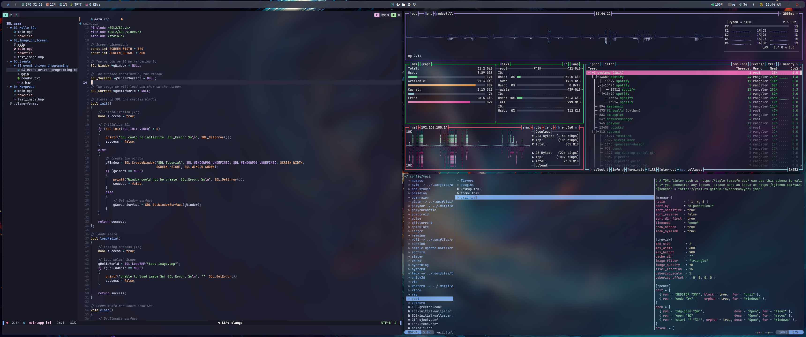

<h1 align="center">DOTFILES | i3WM</h1>




## Dependencies

* i3WM
* FZF
* Kitty
* Picom
* Polybar
* Rofi (adi1090x/rofi configuration)
* Starship
* Stow
* Tmux
* Zsh
* Oh My Zsh

## Installation

### ⓘ Info

> 1. The installation only works on **ARCH** for now.
> 2. The look and feel is made for i3WM only. The rest of the configurations
> (neovim, polybar, etc) will be applied normally.

1. Clone this repo in your `$HOME` directory

```
git clone --depth=1 https://github.com/ErlanRG/.dotfiles
cd ~/.dotfiles
```

2. Run the `build.sh` script

### ⚠ WARNING

The `build.sh` script is still under development. You might encounter issues.
